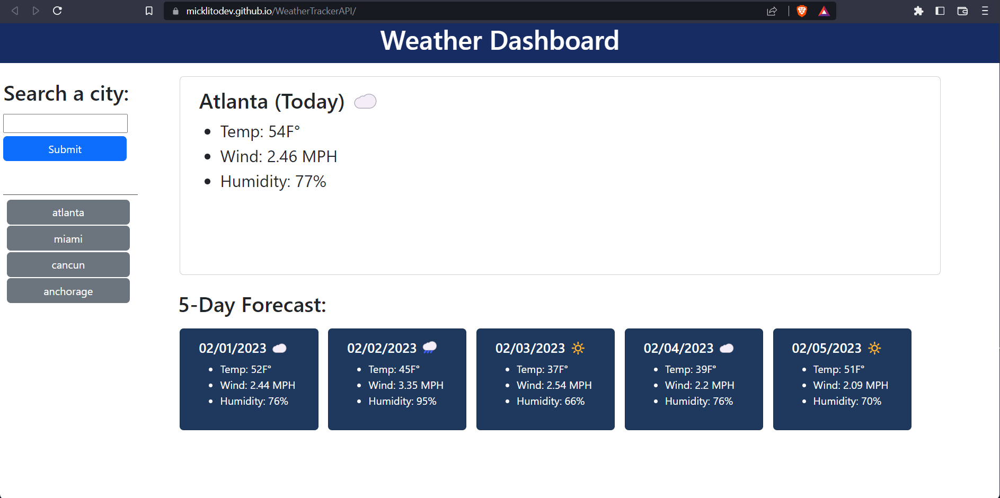

# WeatherTrackerAPI

## Link

Click [- here -](https://micklitodev.github.io/WeatherTrackerAPI/) to go to the live link.

## ScreenShot

## Description

Please read each section to better understanding of the idea behind this project.

- Javascript is the primary language used to build this application. 

- Why did you build this project? To provide an easy to use Weather application that provides users with a weekly forecast 
  as well a current day forecast and to better display my skills and assets as a software developer
  to hiring jobs and companies. 

- What problem does it solve? This application can be used plan outdoor activities or deciding on when to leave one location
  to a next since weather has a strong corralation to traffic. 

## Usage

To use this application,

- Upon loading the page you will see that there it auto renders data from Atlanta, However, if youve previously used the app
  data persistance will store the last location viewed. To change location simply enter in text input is formatted so that 
  text input is not case sensitive or space sensitive. However, a valid city must be entered. One complete clicking submit will
  render the Todays forecast and the following 5 days. Button Elements will be added as you enter in diffrent locations. They can be
  clicked to quickly pull previous data. 

- Enjoy!

Thank you!

## Credits
____________________________________________

APPLICATION - 

Creator: Michael Lito

____________________________________________

API -  

Weather Data Api: https://openweathermap.org/

Geological Api: https://openweathermap.org/

____________________________________________

## License

none

---